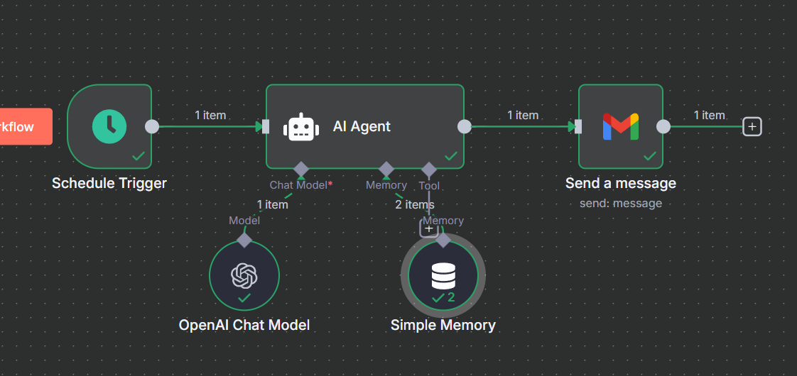

# AI Mail Analyst

AI Mail Analyst automates daily delivery of the latest AI news, predictions, and expert tips to your email. It sources, structures, and formats information in HTML for seamless reading, empowering users with concise, relevant insights.

## Features
- Scheduled daily AI news and trends
- Short- and long-term predictions
- Suggestions for students, professionals, and businesses
- Expert analysis and professional email delivery

## Usage
1. Configure your email credentials.
2. Set your preferred schedule.
3. Receive AI news in your inbox—ready to read and share.

## Tech Stack
- Automation: n8n workflow
- AI content: OpenAI GPT-4.1-mini
- Delivery: Gmail integration

